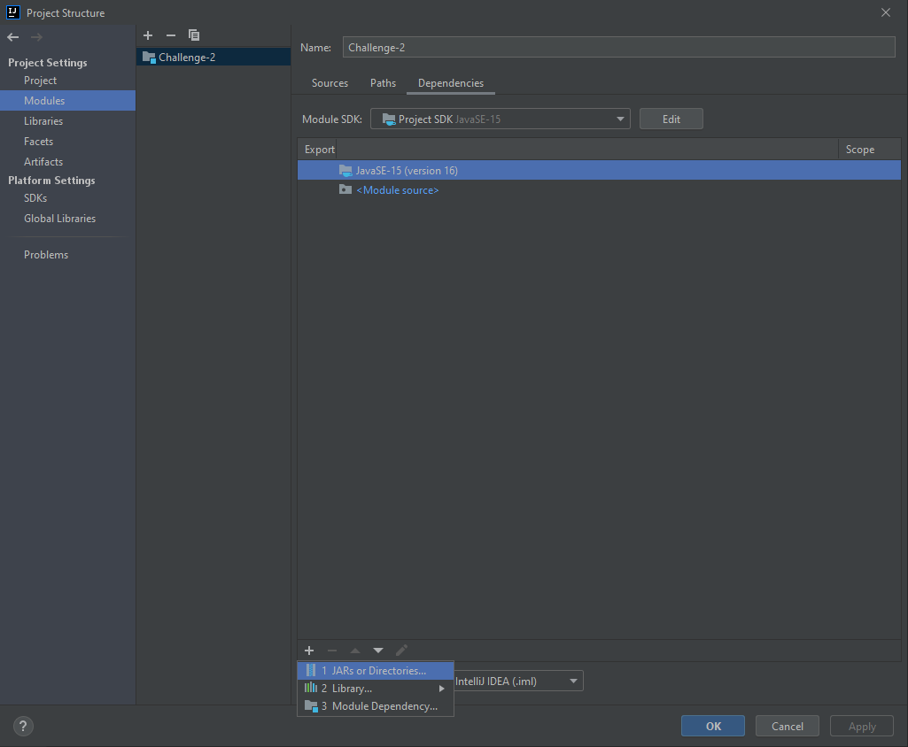

# IntelliJ Setup

To begin, open the project using IntelliJ. If you do not have a project open, you can simply press ``Open``. Otherwise, select ``File > Open...``. In this window, select the ``Challenge-2`` folder of the cloned repo. An example is shown below:

With the project open, you will need to add the dependencies. To do this, right-click on ``Challenge-2`` in the project view, and select ``Open Module Settings``. This will bring project structure window. Press the ``+`` button in the bottom left of this window, and select ``1 JARs and Directories...``. An example is shown below:

In the new window, find and select the JAR file for the GitSubProcessClient (it should be called ``GitSubprocessClient-v0.0.9.jar``) and press ``OK``. The JAR file should now be listed, and you can press ``Apply``. An image of this window is shown below. If the JAR file is listed, press ``OK``.

If everything worked, your project should look something like this:

With that all set up, you should be able to run the application!

Return to [main page](./)