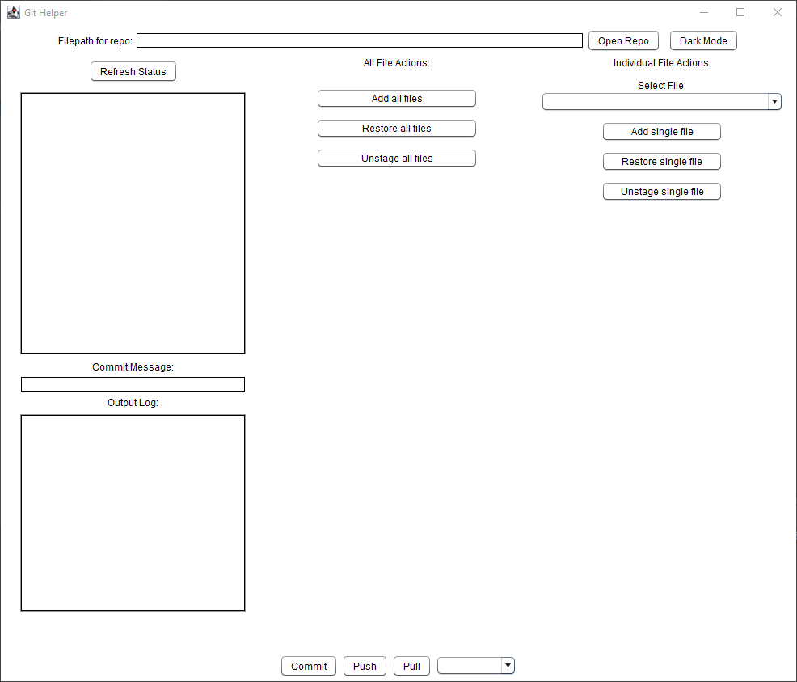
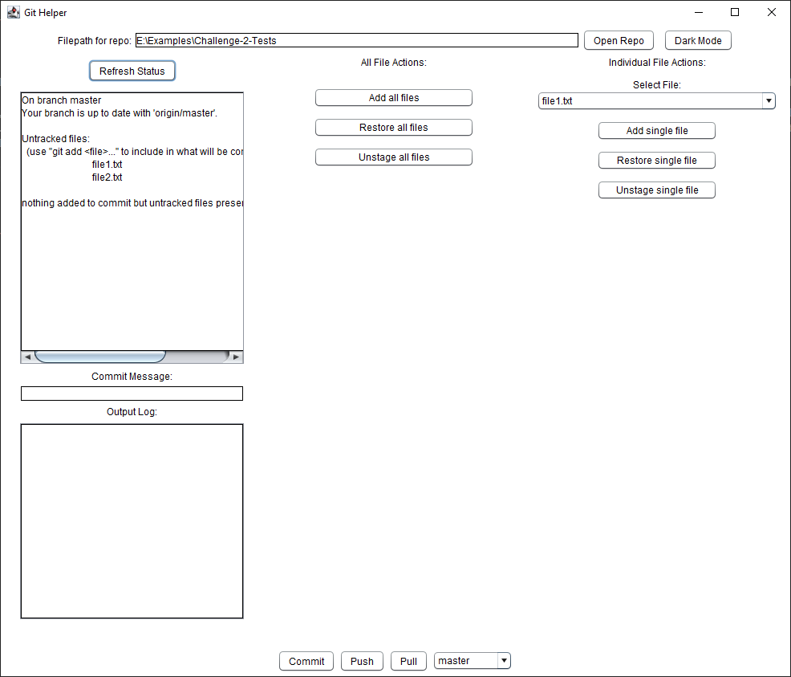

# Usage

Upon running the application, you should be shown a window similar to this:

This window allows you to select a local repo from your computer using the file path, and then run Git commands in that repo without the use of the terminal.

To open a repo, type (or paste) the file path of your repo in the bar at the top of the screen, and press ``Open Repo``. This will automatically update the status box as well as all the dropdown menus. This application can only work with changed files, so make sure to finish making changes first, then press ``Refresh Status`` to update the app again. Once you have done that, you should see something like this, assuming that you have made some changes to the repo:

(Note: In this case, I have my repo in the directory ``E:\Examples\Challenge-2-Tests``)

Now using the buttons to the right of the textboxes, you can either add files to be committed to the repo, restore files to their previous state in the repo, or unstage files that were added to be committed. You can either do this to all files, or individually to specific files.

Once you have added all your changes, you can type a message into the ``Commit Message`` box, and press ``Commit`` to create a commit in your local repo. You can then push your local commits to the current branch with ``Push``, or you can pull in missing commits from any branch using the branch dropdown menu and ``Pull``.

(Note: In order to push, you need to make sure that your GitHub credentials are loaded into the credential manager)

Finally, you can switch between a light and dark theme with the button in the top right.

Return to [main page](./)